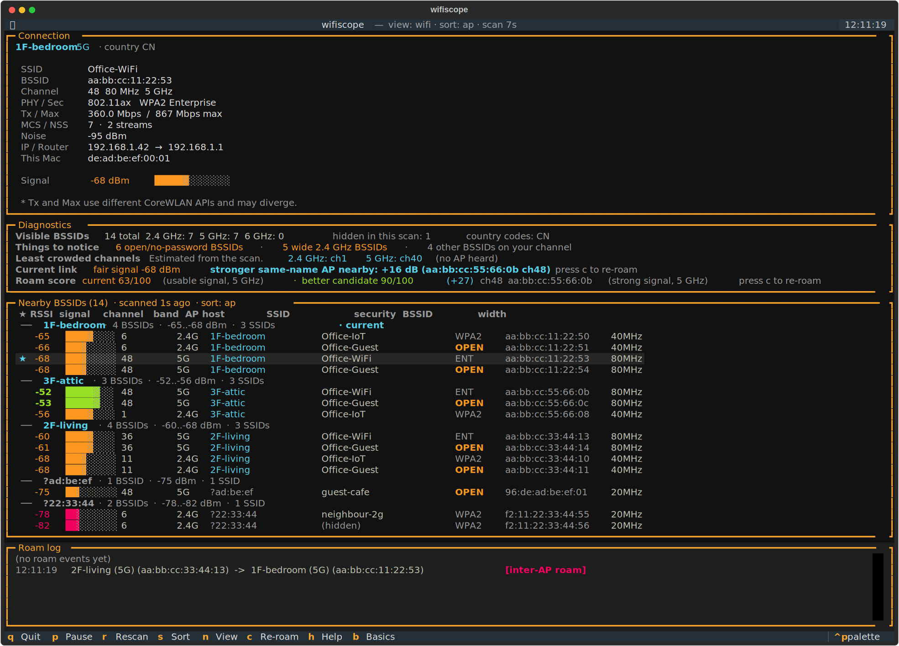
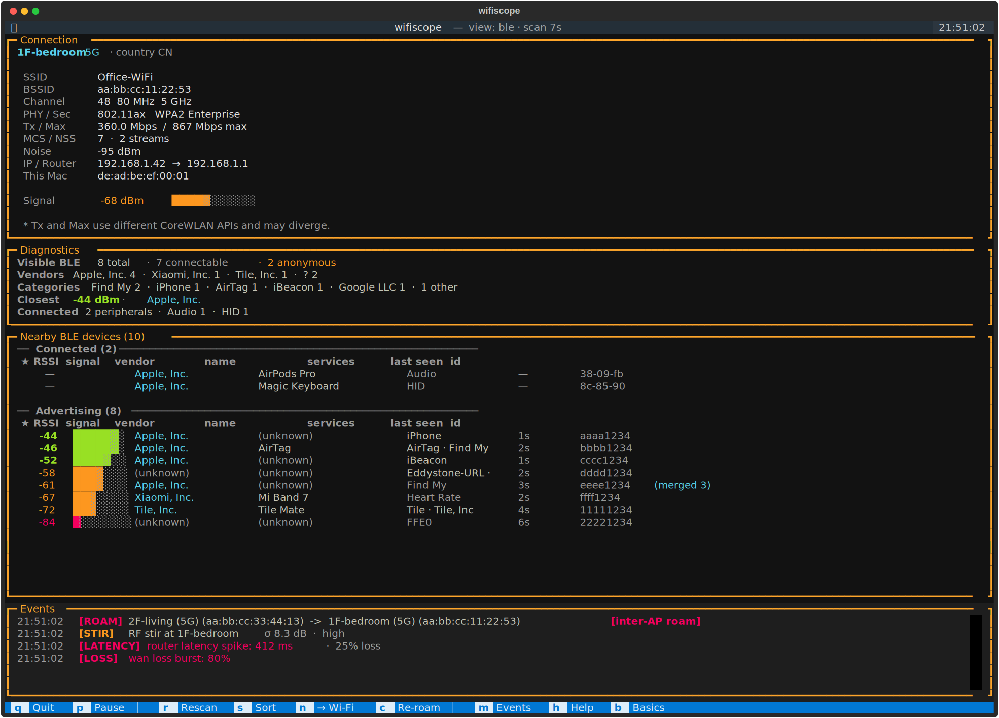
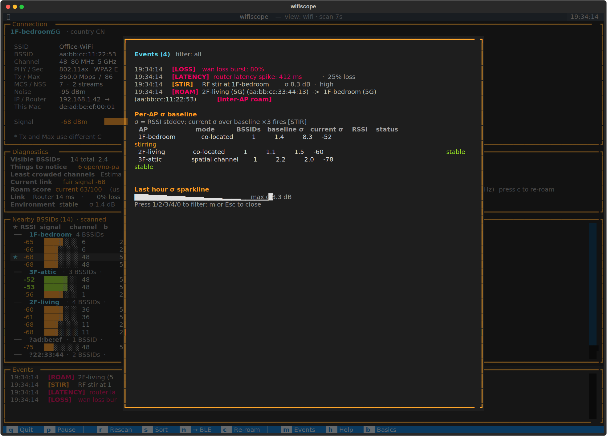

<p align="right">
  <strong>English</strong> · <a href="docs/zh/README.md">中文</a>
</p>

<p align="center">
  
</p>

<p align="center">
  <strong>Your Mac hears more than it tells you.</strong>
  <br>
  <sub>A macOS terminal listening post for Wi-Fi, BLE, link health, and the RF environment.</sub>
</p>

<p align="center">
  <a href="https://github.com/chenchaoyi/diting/actions/workflows/test.yml"></a>
  <a href="https://github.com/chenchaoyi/diting/releases"></a>
  <a href="LICENSE"></a>
</p>

---

<p align="center">
  
  <br>
  <sub><i>Wi-Fi view (default)</i></sub>
</p>

<p align="center">
  
  <br>
  <sub><i>BLE view (press <code>n</code> to toggle) — Connected peripherals on top, Advertising devices below, each labelled with its public-format identification.</i></sub>
</p>

<p align="center">
  
  <br>
  <sub><i>Events modal (press <code>m</code> to open) — last 100 roam / RF-stir / latency / loss / link events, per-AP σ baseline, last-hour σ sparkline.</i></sub>
</p>

## Why

macOS perceives a lot of signal around your Mac — Wi-Fi networks
coming and going, BLE devices broadcasting nearby, gateway latency
stretching, RF noise rising — and its built-in UI shows almost
none of it. Apple's Wi-Fi panel reports the *current* signal and
nothing else. Bluetooth Settings shows what you've paired, never
what's around. macOS has no surface at all for "is my gateway
healthy" or "did something just change in the room."

diting fills that gap. It runs in your terminal as a four-panel
TUI on top of the same APIs Apple uses internally:

- **Wi-Fi visibility.** Every BSSID in range, grouped by physical
  AP. Plain-language diagnostics on top of dense scan data —
  visible-BSSID counts, channel crowding, least-crowded channel
  hints, current-link health, a roam score with reasons. Roam
  events get logged as they happen, tagged
  `[band switch on <AP>]` vs `[inter-AP roam]`.
- **BLE deep identification.** Two sections: *Connected* peripherals
  you're using right now (AirPods, Magic Keyboard, Apple Watch —
  devices that don't advertise and so are invisible to plain BLE
  scanners), and *Advertising* devices broadcasting nearby —
  identified as `AirTag`, `iBeacon`, `Eddystone-URL`, `Tile`,
  `SmartTag`, `iPhone`, `Mac`, `Apple Watch`, `HomePod` instead of
  the "Apple, Inc. (anonymous) Find My" wall. Press `i` on any row
  for a detail view: full identifier, decoded payload, RSSI history
  sparkline, distance estimate.
- **Link health.** Continuous gateway + WAN probes. The `Link` row
  reads `gw 12 ms · 0% · WAN 18 ms · 0% · jitter 3 ms` so a -55 dBm
  AP that *looks* fine reads correctly as bad when upstream is
  dropping packets.
- **RF environment monitor.** Rolling RSSI variance per AP with a
  `stable` / `active` qualifier (calibrate to `quiet` with
  `diting calibrate`). Surfaces "something changed" without making
  a presence claim — correlation, never causation. **NOT** Wi-Fi
  sensing — see
  [`docs/explainers/wifi-sensing.md`](docs/explainers/wifi-sensing.md)
  for what diting deliberately does not claim.
- **Unified events log.** Roam / RF stir / latency spike / loss
  burst / link state — all five event types stream into one ring
  buffer. Press `m` for a full-screen browser of the last 100; use
  `diting monitor` for headless JSONL output to a Home Assistant
  pipeline or a `tail -F` audit window.

For instance: you walk between rooms, your Mac stays glued to the
AP it associated with five hours ago at -75 dBm — even though
there's a new -45 dBm one within reach broadcasting the same SSID.
Zoom stutters and you blame the Wi-Fi. Apple's panel won't tell you
which AP you're on; diting will, and the `c` binding cycles the
radio so macOS re-runs auto-join and reassociates with the strongest
BSSID. Same path as menu-off-then-on, in one keystroke.

## What you can do with it

- **Diagnose home or office network issues.** When Zoom is bad — is
  it RSSI? gateway? WAN? a noisy channel? someone hammering the
  uplink? The Diagnostics panel + `Link` row + Events strip narrow
  it down without you reading raw packets.
- **Find Bluetooth things around you.** What IoT is in this room?
  Where's that AirTag? The BLE list resolves vendor + protocol on
  every advertising device; the detail modal's RSSI sparkline lets
  you walk a target down by signal strength.
- **Catch anomalous signals.** Latency spikes, loss bursts,
  unexplained RF variance — diting names what changed and when.
  Long-running sessions land in `--log` JSONL for after-the-fact
  analysis with `diting analyze`.
- **(Future) Room-presence sensing.** Long-term, hardware-assisted
  flagship. See [Roadmap](#roadmap).

## Quick start

Requires Python 3.11+ and [uv](https://docs.astral.sh/uv/), plus the
Xcode Command Line Tools (the helper bundle is built from a small
Swift source on first launch).

```bash
git clone git@github.com:chenchaoyi/diting.git
cd diting
uv sync
uv run diting
```

On first run, `diting` builds and opens a tiny **helper bundle**
that asks for Location Services permission. Click Allow once; the
window auto-closes; the TUI launches with full SSID and BSSID for
every visible AP. Subsequent runs go straight to the TUI — the grant
is persistent.

> **Why the helper?** macOS 14.4+ redacts SSID and BSSID to None
> unless the calling process has Location Services. A Python CLI
> launched from Terminal cannot get on that list, but a tiny `.app`
> bundle can. `diting` shells out to it for scan data and gets
> the real values back. Press `h` inside the TUI for the full
> story.

## Switching language

```bash
uv run diting --lang zh           # force Chinese
DITING_LANG=zh uv run diting   # via env var
```

With no override, `diting` autodetects the system locale —
`LANG=zh_CN.UTF-8` defaults to Chinese; everything else stays English.

## Bindings

| Key | Action |
|-----|--------|
| `q` | quit |
| `p` | pause / resume polling |
| `r` | force a rescan now (CoreWLAN ~5 s throttle still applies) |
| `s` | cycle scan sort: by AP ↔ by signal |
| `n` | toggle Nearby view: Wi-Fi BSSIDs ↔ BLE devices |
| `c` | force re-roam — cycle Wi-Fi off/on so macOS re-picks the strongest BSSID |
| `m` | open / close the Events modal — last 100 roam / stir / latency / loss / link events |
| `h` | open / close the in-app help screen |
| `b` | open / close Wi-Fi Basics: SSID, BSSID, channel, band, security, roam score |

`watch`, `once`, `monitor`, and `calibrate` subcommands run
diting without the TUI:

```bash
uv run diting once                       # snapshot of current connection, exit
uv run diting watch                      # streaming text events until Ctrl+C
uv run diting monitor                    # headless JSONL events to stdout
uv run diting monitor --out events.jsonl # append JSONL to a file
uv run diting monitor --notify           # macOS Notification Centre alerts on high-confidence events
uv run diting calibrate                  # 5 min "empty room" RSSI baseline → ./diting-baseline.json
```

The `monitor` subcommand is the long-run / Home Assistant
integration target — every roam, RF stir, latency spike, loss
burst, and link-state change emits one well-formed JSON line. The
schema lives in
[`docs/specs/v0.7.0-network-ground-truth-and-environment-monitor.md`](docs/specs/v0.7.0-network-ground-truth-and-environment-monitor.md#single-eventsjsonl-schema-for-all-three-layers).

## Configuration

### AP aliases (optional)

`diting` works fine without any AP-name configuration — every
BSSID gets an auto-clustered label like `?AB:CD:EF` so radios of the
same physical AP group together visually, and roam classification
between APs still works.

If you want **human-readable AP names** (`2F-living` instead of
`?40:fe:95`) in the scan list and roam log, drop a file at
`./aps.yaml` (next to the executable / the cloned repo's
`aps.example.yaml`):

```yaml
aps:
  - name: 1F-bedroom
    mgmt_mac: 40:fe:95:8a:3c:07
  - name: 2F-living
    mgmt_mac: 40:fe:95:8a:3c:54
  - name: 3F-attic
    mgmt_mac: bc:22:47:ca:79:46
```

`diting` then renders **`2F-living (5G)` (40:fe:95:8a:3c:58)** in
place of the raw BSSID, and roam events read `[band switch on
2F-living: 5G → 2.4G]` or `[inter-AP roam]`.

**Where the mgmt MACs come from.** Most controllers (H3C, Aruba,
Ubiquiti, Cisco, ASUS mesh, …) expose only an AP-level **management
MAC** per access point, not the per-radio BSSIDs each AP actually
broadcasts. Read those off the controller's **AP list page** —
typically at the controller's web UI under "Access Points" / "AP
列表" / "Devices" — then paste them into `aps.yaml` with whatever
spatial labels make sense to you.

**When to skip this entirely.** On enterprise / shared / unfamiliar
networks where you can't access the controller, just don't create
`aps.yaml`. The auto-cluster labels (`?AB:CD:EF`) already correctly
group every radio of one physical AP under a single label — you
lose the friendly name, but every other feature works.

If your AP vendor randomises per-radio MACs (rare; some Cisco
Meraki SKUs), add a `radio_overrides` map mapping specific BSSIDs
to AP names. See [`aps.example.yaml`](aps.example.yaml).

Set `DITING_INVENTORY=/some/path/aps.yaml` to load the file from
somewhere other than the current working directory.

### Environment variables

| Variable | Default | Effect |
|---|---|---|
| `DITING_LANG` | autodetected | UI language: `en` or `zh`. Equivalent to `--lang`. |
| `DITING_INVENTORY` | `./aps.yaml` (CWD-relative) | Path to the AP-aliases YAML. The file is optional; if absent, diting uses auto-cluster labels. |
| `DITING_HELPER` | searched in `/Applications`, `~/Applications`, repo `helper/` | Path to the `diting-tianer.app` bundle or its binary. |
| `DITING_SCAN_INTERVAL` | `7` | Seconds between scans. CoreWLAN throttles around 5 s, so values below ~6 yield empty scans every other call. Floor 3. |
| `DITING_LATENCY_WAN_TARGET` | autodetected from `scutil --dns` | IP for the WAN latency anchor. Default picks the first non-gateway nameserver from `SCDynamicStoreCopyValue("State:/Network/Global/DNS")`; if the only configured DNS *is* the gateway, the WAN probe is skipped and the diagnostic line reads `WAN n/a (DNS == gateway)`. Override to pin an explicit IP (e.g. `1.1.1.1` for networks that allow it). |

## macOS caveats

**Some neighbours' SSIDs come back `(hidden)`.** That's the 802.11
hidden-SSID bit — the AP is broadcasting normally, just with the
SSID information element blanked. BSSID, channel, signal, and
capabilities are all still visible. Hidden ≠ undetectable.

**`Tx Rate` and `Max Link Speed` may diverge.** Apple's
`transmitRate` (current data rate, can include frame aggregation)
and `maximumLinkSpeed` (radio capability ceiling at the negotiated
PHY/MCS/NSS) come from different CoreWLAN APIs; "current ≤ max" is
not guaranteed. The Connection panel shows both with a footnote.

**The Diagnostics panel is a guide, not an RF survey tool.** Channel
recommendations and roam scores are estimated from the BSSIDs
visible to CoreWLAN in the latest scan. They reward stronger RSSI,
better SNR, cleaner bands, and less crowded channels, and they
penalize open networks and security mismatches. Treat them as
"where to look next" hints rather than as Apple's official roaming
decision.

**`OPEN` means no Wi-Fi-layer password/encryption.** Captive portals
can still ask for login after association, but the radio link itself
is open. The Nearby BSSIDs panel marks these rows so you can assess
guest networks and accidentally-open SSIDs quickly.

**Without the helper, the Nearby BSSIDs scan list is fully redacted.**
RSSI, channel, band, and width still come through, but every SSID
shows `(redacted)` and every BSSID `(redacted)`. The Connection
panel itself is unaffected — `diting` reads SSID and BSSID for
the *current* AP through a separate SCDynamicStore tunnel that
macOS forgot to redact.

**BLE devices rotate their identifier for privacy.** The same
physical device (an AirTag, a phone, an Apple Watch) appears under
multiple CoreBluetooth UUIDs over time. diting's fuzzy merger
collapses obvious duplicates into one row by matching `(vendor_id,
name)` plus an RSSI window, and shows a `(merged N)` badge on the
combined entry, but the heuristic is conservative — anonymous
beacons (no vendor, no name) are never merged because conflating
them would silently remove signal. Expect to see one or two extra
rows per rotating device when names disagree.

**BLE range is short** (~10 m vs Wi-Fi's ~30 m), so the BLE list
will feel "smaller" than the Wi-Fi scan even on a busy floor.

**macOS hides the underlying BLE MAC**. CoreBluetooth gives only
a per-host UUID; vendor identification goes through the
manufacturer-data company ID field exclusively. diting decodes
the *public* portions of Apple Continuity (the Nearby Info
device-class nibble — `iPhone` / `iPad` / `Mac` / `Apple TV` /
`HomePod` / `Apple Watch`) and the Find My / iBeacon signatures,
but the encrypted payloads (lock state, AirDrop, Music-playing,
Handoff session info) stay opaque. Per-model identification
(iPhone 14 vs 15) is *not* in any public ad packet — anyone
claiming to do that is reading proprietary GATT services after
connecting, which diting will not do.

**The Environment line is *not* Wi-Fi sensing.** diting sits in
Tier 0 of the Wi-Fi-sensing capability ladder: rolling RSSI variance
on the data CoreWLAN already exposes. The line surfaces a binary
`stable` / `active` (or `quiet` after `diting calibrate`)
qualifier — never people-counting, never motion-with-pose, never
breathing rate. Channel State Information (the data the academic
sensing literature actually uses) is not exposed by macOS, and even
where it is exposed (ESP32, Intel 5300 under Linux) the Tier-3+
demos require a research stack, not a `pip install`. See
[`docs/explainers/wifi-sensing.md`](docs/explainers/wifi-sensing.md)
for the full story; the `Environment` line is the live example of
what diting honestly does with RSSI.

**Connected peripherals have no RSSI.** `retrieveConnectedPeripherals`
returns the devices currently associated with the Mac
(AirPods you're listening to, Magic Keyboard you're typing on),
but reading their signal mid-session would require `readRSSI()`
against an active connection — an invasive perturbation diting
deliberately avoids. The Connected section shows `—` for the
signal column and sorts alphabetically by name.

**`disassociate()` is unreliable for forcing a roam.** Earlier
versions of `diting` used `iface.disassociate()` for the `c`
binding; on 802.1X enterprise networks it would tear down the link
and macOS would not auto-rejoin. Cycling power via
`setPower(false)` then `setPower(true)` mirrors the Wi-Fi-menu
off/on path and reliably triggers full auto-join with Keychain
credentials.

## Contributing

Contributing? See [`DEVELOPMENT.md`](DEVELOPMENT.md) for the SDD
workflow, capability index, local development commands, bilingual
discipline, and an implementation deep-dive (BSSID resolution,
channel handling, pluggable backend).

Version history lives in [`CHANGELOG.md`](CHANGELOG.md).

## Roadmap

Three buckets: *near-term* gets actively worked, *mid-term* is on
the queue with a clear shape, *further out* is direction without a
timeline. No specific dates — diting is a personal project; the
ordering is intent.

### Near-term

- **mDNS / Bonjour LAN inventory.** A `n`-toggleable third view
  alongside Wi-Fi / BLE listing every Sonos, Apple TV, HomePod,
  NAS, printer, AirDrop-capable Mac, HomeKit hub, Time Capsule,
  and other service-advertising peer. Answers "what's on my
  network and is it alive" with a much richer answer than ARP.
- **Anomaly watchdog mode.** Headless long-runs that push macOS
  Notification Centre alerts on high-confidence events (stir,
  loss burst, latency spike). Today's `diting monitor --notify`
  is the seed; it grows configurable thresholds and per-event
  silence windows.
- **Per-device proximity compass.** When the BLE detail modal is
  open and a row is selected, render a "getting warmer / colder"
  signal-strength compass. Walk down an AirTag, Tile, or any
  advertising device by RSSI gradient.
- **Cellular state, when the Mac silicon exposes it.** A few Mac
  models have cellular modems; tethered iPhone state is broadly
  available via `pymobiledevice3`-style access. Surface signal
  bars + carrier + technology when present, gracefully omit
  otherwise.

### Mid-term

- **Investigate / scenario mode.** A guided entry — `diting
  troubleshoot zoom`, `diting find <name>` — that walks a
  non-power-user through the relevant panels with plain-English
  conclusions. Keeps the dashboard view for power users.
- **JSONL session replay.** `diting replay <file.jsonl>` feeds a
  prior log back through the TUI as if events were happening live,
  for after-the-fact incident review.
- **Trend graphs in the TUI.** RSSI / latency / channel-util over
  time, time-on-AP per BSSID. Builds on the existing JSONL log.
- **Auto-roam mode.** Gated, conservative. When a clearly-better
  same-SSID candidate persists ≥ N seconds, cycle the radio
  automatically — sticky-AP pain hands-free.

### Further out

- **Room-presence sensing — flagship.** Move the RF environment
  monitor from "something changed" to "someone entered the
  living room". This is hard; Tier-3+ sensing requires CSI (not
  exposed by macOS) or a small auxiliary hardware probe. Long-
  term, hardware-assisted, deliberate. See
  [`docs/explainers/wifi-sensing.md`](docs/explainers/wifi-sensing.md)
  for the honest read on what's possible.
- **Optional menu-bar app** for ambient awareness without keeping
  a terminal open.
- **Linux backend.** `nl80211` via `pyroute2` or shelling out to
  `iw scan`. Architecturally already abstracted behind
  `WiFiBackend`; just unimplemented.
- **Continuity / Personal Hotspot / iCloud Private Relay state.**
  Mac-specific integrations surfaced in Diagnostics where they're
  load-bearing for "why is my network weird right now".

## License

MIT. See [`LICENSE`](LICENSE).
