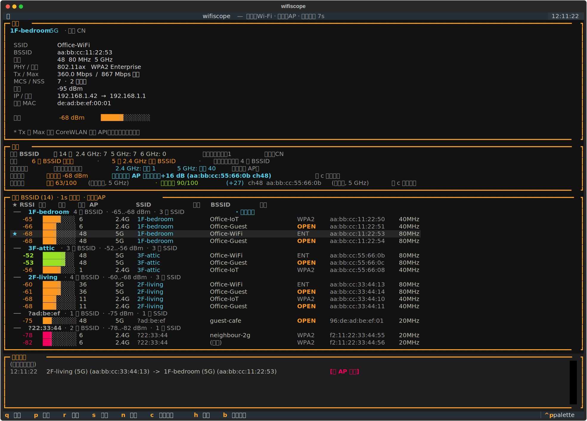
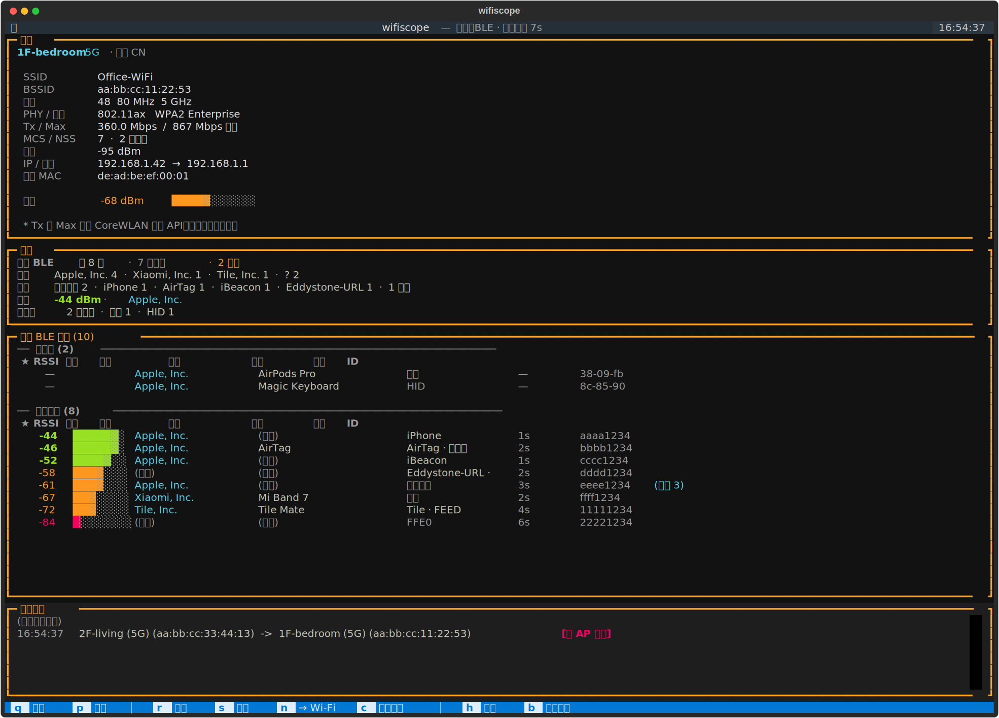
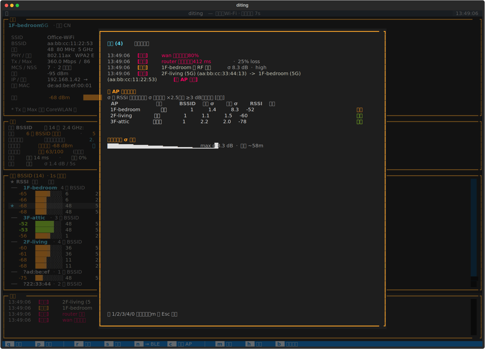

<p align="right">
  <a href="../../README.md">English</a> · <strong>中文</strong>
</p>

<p align="center">
  
</p>

<p align="center">
  <strong>你的 Mac 听见了什么，告诉你。</strong>
  <br>
  <sub>macOS 终端的信号监听台 —— Wi-Fi、BLE、链路健康、RF 环境。</sub>
</p>

<p align="center">
  <a href="https://github.com/chenchaoyi/diting/actions/workflows/test.yml"></a>
  <a href="https://github.com/chenchaoyi/diting/releases"></a>
  <a href="../../LICENSE"></a>
</p>

---

<p align="center">
  
  <br>
  <sub><i>Wi-Fi 视图（默认）</i></sub>
</p>

<p align="center">
  
  <br>
  <sub><i>BLE 视图（按 <code>n</code> 切换）—— 上方是「已连接」外设，下方是「正在广播」设备，每行都给出公开格式识别出的标签。</i></sub>
</p>

<p align="center">
  
  <br>
  <sub><i>事件浏览器（按 <code>m</code> 打开）—— 最近 100 条 漫游 / 扰动 / 延迟 / 丢包 / 链路 事件，附各 AP σ 基线小表 + 最近一小时 σ 走势 sparkline。</i></sub>
</p>

## 为什么需要它

macOS 其实「听见」了你 Mac 周围很多信号 —— Wi-Fi 网络进进出出、BLE
设备广播、网关延迟变化、RF 噪声起伏 —— 但它自带的 UI 几乎一点都不
告诉你。Apple 的 Wi-Fi 面板只显示*当前*信号；蓝牙设置只显示你已配对
的设备，从不显示周围有什么；macOS 根本没有任何界面回答「我的网关
还正常吗」或者「房间里刚才是不是有什么变化」。

谛听就是来填这个空缺的。终端里的四面板 TUI，跑在 Apple 自己也用的
那批 macOS API 之上：

- **Wi-Fi 可见性。** 范围内每个 BSSID，**按物理 AP 分组**。在密集
  扫描数据上叠一层人话诊断 —— 可见 BSSID 数、信道拥挤度、最空信道
  建议、当前链路健康度、带理由的漫游评分。漫游事件实时记录，标
  `[同 AP 切频段]` 或 `[跨 AP 漫游]`。
- **BLE 深度识别。** 分两段：*已连接*外设（AirPods、Magic Keyboard、
  Apple Watch —— 它们不广播，普通 BLE 扫描看不见），*正在广播*的
  设备 —— 直接标注成 `AirTag`、`iBeacon`、`Eddystone-URL`、`Tile`、
  `SmartTag`、`iPhone`、`Mac`、`Apple Watch`、`HomePod`，不再是
  「Apple, Inc.（匿名）Find My」那堵墙。任意行按 `i` 进详情：完整
  identifier、解码后载荷、RSSI 历史 sparkline、距离估算。
- **链路健康。** 网关 + WAN 持续探针。`Link` 行类似
  `gw 12 ms · 0% · WAN 18 ms · 0% · 抖动 3 ms`，让信号好看但上游
  在丢包的 -55 dBm AP 也读得出来。
- **RF 环境监测。** 按 AP 滚动算 RSSI 方差，标 `稳定` / `活跃`
  标签（跑 `diting calibrate` 切到 `安静` 基线）。能告诉你「有变化
  发生」，但不会硬塞「有人」这种因果断言 —— 是相关性，不是因果。
  **不是** Wi-Fi sensing —— 我们刻意不声称的能力见
  [`docs/explainers/wifi-sensing.md`](explainers/wifi-sensing.md)。
- **统一事件日志。** 漫游 / RF 扰动 / 延迟尖峰 / 丢包风暴 / 链路状态
  五种事件流入同一个环形缓冲。按 `m` 看最近 100 条全屏浏览器，或者用
  `diting monitor` 把事件以 JSONL 流到 Home Assistant 管道、`tail -F`
  审计窗口里。

举个例子：你在房间之间走动，Mac 死死黏在五小时之前关联的那台 AP 上
（-75 dBm），旁边明明就有 -45 dBm 同名 AP。Zoom 卡顿，你抱怨网络。
Apple 的面板不会告诉你你连在哪台 AP；谛听会，而且按 `c` 一键循环关
再开 Wi-Fi，让 macOS 重新 auto-join，关联到信号最强的 BSSID。和「点
菜单关 Wi-Fi 再开」同一条路径，一次按键搞定。

## 你能用它做什么

- **排查家里 / 办公室网络问题。** Zoom 卡 —— 是 RSSI？网关？WAN？
  信道拥挤？还是有人在霸占带宽？诊断面板 + `Link` 行 + 事件条把
  问题缩小到具体原因，你不用读原始包。
- **找身边的蓝牙设备。** 这个房间里有哪些 IoT 设备？我那只 AirTag
  在哪？BLE 列表对每个广播设备解析厂商 + 协议；详情模态里的 RSSI
  sparkline 让你按信号强度走过去找。
- **抓异常信号。** 延迟尖峰、丢包风暴、说不清原因的 RF 波动 ——
  谛听会告诉你什么时候变了什么。长时间会话以 `--log` JSONL 留底，
  事后用 `diting analyze` 复盘。
- **（未来）室内人员感知。** 长期目标，需要外置硬件配合。详见
  [路线图](#路线图)。

## 快速开始

需要 Python 3.11+ 与 [uv](https://docs.astral.sh/uv/)，外加 Xcode 命令行工具
（首次启动时会从一份小 Swift 源码自动构建辅助进程）。

```bash
git clone git@github.com:chenchaoyi/diting.git
cd diting
uv sync
uv run diting
```

首次运行时，`diting` 会构建并 `open` 一个迷你的 **辅助进程 .app**，请求
「定位服务」权限。点一次 Allow，窗口自动关闭，TUI 启动并显示完整的 SSID
和 BSSID。后续启动直接进 TUI —— 授权是持久的。

> **为什么需要辅助进程？** macOS 14.4+ 把 SSID 与 BSSID 隐藏成 None，
> 除非调用进程已被授予「定位服务」权限。从 Terminal 启动的 Python CLI 进
> 不了那个权限列表，但一个小 `.app` 打包可以。`diting` 调用它来取扫描
> 数据，从而拿回真实值。在 TUI 里按 `h` 看完整说明。

## 切换语言

```bash
uv run diting --lang zh           # 强制中文
DITING_LANG=zh uv run diting   # 用环境变量
```

不传任何参数时，`diting` 会自动嗅探系统 locale —— `LANG=zh_CN.UTF-8`
默认走中文，其余默认英文。

## 按键

| 键 | 作用 |
|-----|--------|
| `q` | 退出 |
| `p` | 暂停 / 恢复轮询 |
| `r` | 立即重扫（CoreWLAN ~5 秒限流仍然会生效） |
| `s` | 扫描排序切换：按 AP ↔ 按信号 |
| `n` | 切换附近视图：Wi-Fi BSSID ↔ BLE 设备 |
| `c` | 断开重连 —— 关再开 Wi-Fi，让系统重新挑选最强的 BSSID |
| `m` | 打开 / 关闭事件浏览器 —— 最近 100 条 漫游 / 扰动 / 延迟 / 丢包 / 链路 |
| `h` | 打开 / 关闭应用内帮助页 |
| `b` | 打开 / 关闭 Wi-Fi 基础知识：SSID、BSSID、信道、频段、加密、漫游评分 |

`watch`、`once`、`monitor`、`calibrate` 子命令不走 TUI：

```bash
uv run diting once                       # 当前连接快照
uv run diting watch                      # 流式文本事件（Ctrl+C 退出）
uv run diting monitor                    # 无 TUI，逐行 JSONL 事件
uv run diting monitor --out events.jsonl # 追加 JSONL 到文件
uv run diting monitor --notify           # 高置信度事件触发 macOS 通知
uv run diting calibrate                  # 5 分钟「房间没人」基线 → ./diting-baseline.json
```

`monitor` 是长时运行 / Home Assistant 集成场景：每一次漫游、RF
扰动、延迟尖峰、丢包风暴、链路状态变化都会输出一行符合 schema 的
JSON。schema 定义见
[`docs/specs/v0.7.0-network-ground-truth-and-environment-monitor.md`](../specs/v0.7.0-network-ground-truth-and-environment-monitor.md#single-eventsjsonl-schema-for-all-three-layers)。

## 配置

### AP 别名（可选）

`diting` 不需要任何 AP 名字配置就能跑 —— 每个 BSSID 都会被分配一个形如
`?AB:CD:EF` 的自动聚簇标签，同一台物理 AP 的所有无线电会被分到同一组，
跨 AP 漫游分类也照常工作。

如果你想在扫描列表和漫游日志里看到**可读的 AP 名字**（比如 `2F-客厅`
而不是 `?40:fe:95`），在 `./aps.yaml`（与 `aps.example.yaml` 同目录，
通常是 clone 出来的仓库根目录）放一份配置：

```yaml
aps:
  - name: 1F-书房
    mgmt_mac: 40:fe:95:8a:3c:07
  - name: 2F-客厅
    mgmt_mac: 40:fe:95:8a:3c:54
  - name: 3F-阁楼
    mgmt_mac: bc:22:47:ca:79:46
```

`diting` 会用 **`2F-客厅 (5G)` (40:fe:95:8a:3c:58)** 这种形式替换原始
BSSID，漫游事件会显示成 `[同 AP 切频段 2F-客厅: 5G → 2.4G]` 或
`[跨 AP 漫游]`。

**管理 MAC 从哪来。** 大多数控制器（H3C / Aruba / Ubiquiti / Cisco /
华硕 mesh 等）只暴露每台 AP 的**管理 MAC**，并不暴露 AP 实际广播的每个
无线电的 BSSID。从控制器 Web UI 的 **AP 列表页**（一般叫 "Access Points"
/ "AP 列表" / "Devices"）抄出来，按你能记住的空间标签起名字写进
`aps.yaml`。

**什么时候直接跳过。** 在企业网 / 共享网 / 不熟悉的网络里，你拿不到
控制器，那就不要建 `aps.yaml`。自动聚簇标签（`?AB:CD:EF`）已经能正确
把同一台物理 AP 的所有无线电归到一起 —— 你只是少了人可读的名字，其他
功能不受影响。

如果你的 AP 厂商对每个无线电随机化 MAC（少见，部分 Cisco Meraki SKU
会这么做），可以再加一段 `radio_overrides`，把指定 BSSID 直接映射到 AP
名字。示例见 [`aps.example.yaml`](../../aps.example.yaml)。

设 `DITING_INVENTORY=/some/path/aps.yaml` 可以让 diting 从当前
目录之外的位置加载这份文件。

### 环境变量

| 变量 | 默认值 | 作用 |
|---|---|---|
| `DITING_LANG` | 自动嗅探 | 界面语言：`en` 或 `zh`。也可用 `--lang`。 |
| `DITING_INVENTORY` | `./aps.yaml`（相对当前目录） | AP 别名 YAML 路径。文件可选，没有就走自动聚簇标签。 |
| `DITING_HELPER` | 在 `/Applications`、`~/Applications`、仓库 `helper/` 中查找 | 指定 `diting-tianer.app` 包或其二进制路径。 |
| `DITING_SCAN_INTERVAL` | `7` | 扫描间隔秒数。CoreWLAN 大约 5 秒限流一次，低于 ~6 秒时每隔一次返回空。最小 3。 |
| `DITING_LATENCY_WAN_TARGET` | 由 `scutil --dns` 自动检测 | WAN 延迟探针的 IP。默认从 `SCDynamicStoreCopyValue("State:/Network/Global/DNS")` 取第一条非网关 DNS；如果配置的 DNS 就是网关，WAN 探测被跳过，诊断行写 `WAN n/a (DNS = 网关)`。可以指定固定 IP（如 `1.1.1.1`，仅在网络允许时使用）。 |

## macOS 注意事项

**部分邻居的 SSID 显示为 `(隐藏)`。** 这是 802.11 的隐藏 SSID 位 —— AP 在
正常广播，只是 SSID 信息字段被刻意空置。BSSID、信道、信号、能力都还能看见。
隐藏 ≠ 不可探测。

**`Tx Rate` 与 `Max Link Speed` 可能不一致。** Apple 的 `transmitRate`
（当前数据速率，可能含帧聚合）与 `maximumLinkSpeed`（在已协商的 PHY/MCS/NSS
下的能力上限）取自不同的 CoreWLAN API；并不保证「当前 ≤ 最大」。Connection
面板同时显示两者并附说明。

**诊断面板是引导，不是 RF 勘测工具。** 信道建议和漫游评分都由 CoreWLAN 最近
一次扫描里可见的 BSSID 估算而来。它会奖励更强 RSSI、更好 SNR、更干净的频段
和更空的信道，惩罚开放网络与加密类型不一致的候选。请把它当成「下一步该看
哪里」的提示，而不是 Apple 官方的漫游决策依据。

**`OPEN` 表示 Wi-Fi 层没有密码 / 加密。** Captive portal 仍可能在关联后要求
登录，但无线电链路本身是开放的。附近 BSSID 面板会标记这类行，便于快速评估
访客网络与意外开放的 SSID。

**没有辅助进程时，附近 BSSID 扫描列表会被完全隐藏。** RSSI、信道、频段、
带宽仍然可读，但每个 SSID 都显示成 `(已遮蔽)`，每个 BSSID 也是
`(已遮蔽)`。Connection 面板不受影响 —— `diting` 通过另一条 SCDynamicStore
旁路读取*当前*关联 AP 的 SSID 与 BSSID，而 macOS 忘了对这条路径脱敏。

**BLE 设备会为隐私轮换标识。** 同一台物理设备（AirTag、手机、Apple
Watch）会在不同时段以不同 CoreBluetooth UUID 出现。diting 的
模糊合并器会把 `(vendor_id, name)` 一致且 RSSI 在 ±10 dB 以内的条目
合并成一行，并在合并后的行上显示 `(合并 N)` 徽章 —— 但策略保守：完全
匿名（厂商和名字都为空）的信标永远不合并，否则会静默吞掉真实信号。
名字时有时无的设备多半会多出一两行，属于预期。

**BLE 距离短**（约 10 m，Wi-Fi 约 30 m），所以 BLE 列表通常会比
Wi-Fi 扫描"小一圈"，即便在密集楼层也是如此。

**macOS 不暴露 BLE 的底层 MAC**。CoreBluetooth 只给出每台主机一个
UUID；厂商识别只能走 manufacturer-data 公司 ID 字段。diting 解析
Apple Continuity 的*公开*部分（Nearby Info 里未加密的设备类别 nibble
—— `iPhone` / `iPad` / `Mac` / `Apple TV` / `HomePod` / `Apple Watch`）
以及 Find My / iBeacon 的签名，但加密载荷（锁屏状态、AirDrop、正在
播放音乐、Handoff 会话信息）保持不可见。**单机型识别**（iPhone 14 vs
15）不在任何公开广告报文里 —— 谁要是声称做到了，那是 connect 之后
读取专有 GATT 服务，我们不做这件事。

**`Environment` 行不是 Wi-Fi sensing。** diting 处于 Wi-Fi 感知
能力阶梯的 Tier 0：用 CoreWLAN 已经暴露的数据做滚动 RSSI 方差。
我们只输出 `稳定` / `活跃`（跑过 `diting calibrate` 之后是
`安静` / `活跃`）这种二值标签 —— 永远不会做人数统计、姿态识别、
呼吸频率检测。CSI（学界 sensing 真正用的数据）在 macOS 上不开放，
即使在 ESP32 / Linux 下的 Intel 5300 上也开放，那些 Tier-3+ demo
也是研究级工程，不是 `pip install`。完整说明见
[`docs/explainers/wifi-sensing.md`](explainers/wifi-sensing.md)；
`Environment` 行就是「我们用 RSSI 老实做了什么」的现场示例。

**已连接外设没有 RSSI。** `retrieveConnectedPeripherals` 给出当前与
Mac 关联的外设（你正在听的 AirPods、正在敲的 Magic Keyboard），但要
中途读它们的信号需要对活动连接调用 `readRSSI()` —— 这是一次有副作用
的打扰，我们刻意不做。已连接段在信号列里写 `—`，按名字字母排序。

**`disassociate()` 在强制漫游上不可靠。** `diting` 早期版本曾用
`iface.disassociate()` 实现 `c` 键；在 802.1X 企业网络上，它会把链路拆掉
但 macOS 不会自动重连。改成 `setPower(false)` + `setPower(true)` 之后
路径与 Wi-Fi 菜单的关再开一致，能可靠触发完整 auto-join，复用 Keychain
凭据。

## 贡献

参与开发？请看 [`DEVELOPMENT.md`](DEVELOPMENT.md)（[English](../../DEVELOPMENT.md)）：
SDD 工作流、能力索引、本地开发命令、双语纪律，以及实现细节
（BSSID 解析、信道处理、可插拔 backend）都在那里。

版本变更记录见 [`CHANGELOG.md`](CHANGELOG.md)。

## 路线图

分三档：*近期*正在做或马上做，*中期*在队列上、形态已经清楚，
*远期*只是方向，没有时间承诺。不写具体日期 —— 谛听是个人项目，
顺序代表意图。

### 近期

- **mDNS / Bonjour LAN 设备清单。** 新增 `n` 键切换的第三种视图，
  与 Wi-Fi / BLE 平级，列出本地网络上每台 Sonos、Apple TV、HomePod、
  NAS、打印机、可 AirDrop 的 Mac、HomeKit 网关、Time Capsule。
  比单纯 ARP 扫描信息丰富得多，回答「我网络里有什么、还活着吗」。
- **异常守望模式。** 无 TUI 长跑模式，对高置信度事件（扰动、丢包
  风暴、延迟尖峰）推 macOS 通知中心提醒。`diting monitor --notify`
  是种子；下一步加可配置阈值、按事件类型设置静默窗口。
- **单设备方向感（"近 / 远"罗盘）。** BLE 详情模态打开时，对当前
  选中行渲染一个按 RSSI 强弱变化的「热 / 冷」罗盘 —— 顺着信号
  梯度走过去找 AirTag、Tile 等任意广播设备。
- **蜂窝状态（Mac 硅芯片暴露的范围内）。** 少数 Mac 机型有蜂窝调制
  解调器；通过 `pymobiledevice3` 类似的方式可以读取 tethered iPhone
  的蜂窝状态。有就显示信号格 + 运营商 + 网络制式，没有就优雅省略。

### 中期

- **场景化 / 排查模式。** 一组 guided 入口 —— `diting troubleshoot
  zoom`、`diting find <name>` —— 引导非高级用户走一遍相关面板，
  给出人话结论。Power user 仍然可以用 dashboard 视图。
- **JSONL 会话回放。** `diting replay <file.jsonl>` 把历史日志重新
  喂进 TUI，模拟事件实时发生，用于事后复盘网络故障。
- **TUI 内的趋势图。** RSSI / 延迟 / 信道利用率随时间变化，每个
  BSSID 的关联时长。基于已有的 JSONL 日志。
- **自动漫游模式。** 门控、保守。当同名 SSID 候选明显更优持续
  ≥ N 秒后自动循环关再开 Wi-Fi。无人值守解决卡死弱 AP 的原始痛点。

### 远期

- **室内人员感知 —— 旗舰能力。** 把 RF 环境监测从「有变化」推进到
  「有人进了客厅」。这件事很难；Tier-3+ 级别的 sensing 需要 CSI
  （macOS 不暴露）或者一个外置硬件探针。长期、需要硬件、谨慎推进。
  详见 [`docs/zh/explainers/wifi-sensing.md`](explainers/wifi-sensing.md)
  里关于「能做到什么」的诚实评估。
- **可选的菜单栏 App。** 不开终端也能 ambient 感知。
- **Linux backend。** 通过 `pyroute2` 调 `nl80211`，或 fork `iw scan`。
  架构上 `WiFiBackend` 抽象层已经为它留好位置；只是没实现。
- **Continuity / 个人热点 / iCloud Private Relay 状态。** Mac 专属
  整合，在它们对「我的网络为什么现在怪怪的」起决定作用时呈现在
  诊断面板里。

## License

MIT。见 [`LICENSE`](../../LICENSE)。
